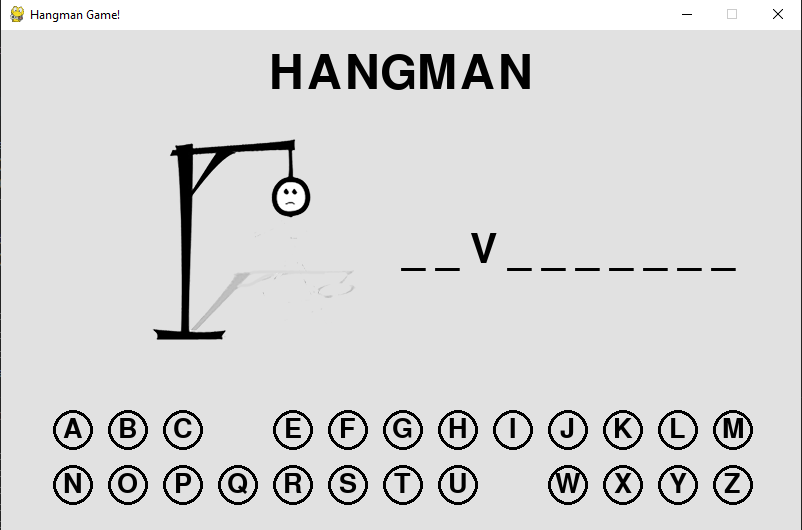

# Hangman Game GUI  


created Hangman Game Using Python3 & pygame Module with an intractive interface which takes input from both keyboard and mouse and detects what button you have pressed , program matches your answer with the answer in file and tells weather you win or loose in the given number of turns. Also used mixer to play the music in the game.
use mouse or keys to click on the buttons shown on the screen to select your move, try to win .
program changes the image as you select the move to show on the screen.
Hope You Will Like The Game. also u can use the code to make your own version of game.

Also created `hangmangame.py`to play command line version of game
```
Guess the words  
L_ WLY   o      
LAWIYO
LOWLY  
 Congrats, you guessed the word! YOU WIN!! 
You took  2 turns to win !
Press s to play again   
```
## How to play
Playing this Hangman game is easy: Simply download the repository to your computer and run `hangman.py` or `hangmanWithGUI.py` ! The game comes with its own included word list, `wordsvault.py`, which contains a list of 2,465+ English words from which the game can draw.

## Customization
Want to specify your own list of words in place of the included `wordsvault.py`? Simply overwrite that file with a text file of your own of the same filename, with each word on a separate line. Compound words with spaces involved work, too (eg., ice cream).

You can also add new words onto the included `wordsvault.py` file to be used in the game. Words can be added at any place in the file but, again, add one word per line.:smile:

 


### Module used
python modules
```
import pygame
import math
import random
from wordsvault import wordsare
```
`from wordsvault import wordsare` (importing words from different file nameing wordsvault)

## PRE-REQUISITES
Your laptop with 3.7.x (onwards) installed.

**NOTE:** Those with Linux and MacOSX would have Python installed by default, no action required.

Windows: Download the version for your laptop via https://www.python.org/downloads/

**NOTES**
In your preferred editor, make sure indentation is set to "4 spaces".

* Make sure you have **pygame**  installed in python otherwise code may fail,
* to install pygame in your machine > open python in your terminal then type `pip install pygame` to install. :warning:
* Do not delete this file or program may fail `wordsvault.py` :warning:

* random and math are built-in python module so no need to worry about that.

---

Do not Delete any images Files or IT MAY CRASH THE GAME!

## Run using Python3.8+
1. Clone or download repositiory: https://github.com/arevish/HangmanGUI.git
2. In source folder, run `python3 'HangmanWithGUI.py'` to start program, optionally, run with `--help` argument to see other runtime options.


### ThankYou!
